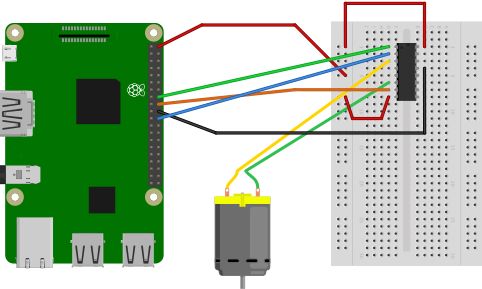

1. [Connect the Raspberry Pi to doorbell](#connect-the-raspberry-pi-to-doorbell)
2. [Control IR Cut-Off filter with GPIO](#control-ir-cut-off-filter-with-gpio)

## Connect the Raspberry Pi to doorbell

_Connecting the Raspberry Pi to your current doorbell involves modifying electricity wiring of the doorbell. **DO IT AT YOUR OWN RISK. I cannot be held responsible**_

My doorbell uses a 16VAC transformer (which I think is a standard in North America). 

Hardware I used:

- [Push button](https://www.adafruit.com/product/1119)
- [1kΩ resistor](https://www.adafruit.com/product/4294)
- [LED](https://www.adafruit.com/product/1757)
- [NPN transistor](https://www.adafruit.com/product/756) (Mine has ref: 2N2222)
- [Diode](https://www.adafruit.com/product/755)
- [Relay 5VDC #srd-05vdc-sl-c](https://www.amazon.com/Senmod-Household-Appliance-SRD-05VDC-SL-C-Arduino/dp/B07MJJYRQJ/r)

#### Breadboard

#### Schematic

## Control IR Cut-Off filter with GPIO

If you have IR Cut-Off filter which looks like [this](http://ae01.alicdn.com/kf/HTB1PanGlXuWBuNjSspnq6x1NVXai.jpg), chances are great that it needs 3.3V to move it in place and it needs the polarity to be reversed to move it back.

_ToDo, the enabler pin seems to be useless. Try it without connecting this pin._

Hardware I used:

- [Motor L293DNE](https://www.adafruit.com/product/1119)

#### Breadboard

