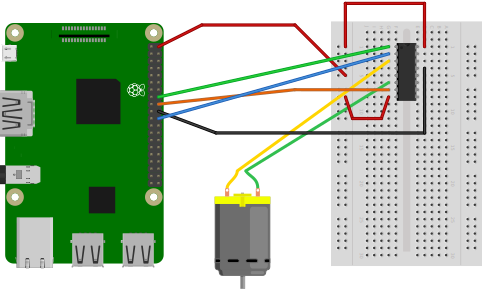

## Introduction
Why buy a Nest Hello or Amazon Ring when you can do it yourself with a Raspberry Pi.  
The idea is pretty simple. When the button is pressed, a notification is sent to [Telegram](https://telegram.org/) and the doorbell rings. 

**Software:**

- A Telegram API Token

**Hardware:**

- RaspberryPi (I use the 3B+ model)
- Camera
- [Electronic components](#) to connect existing doorbell


If you want 2-ways communication (not implemented yet), you also need:

- Speaker
- Microphone

After many tries/errors, I decided to use a [USB Camera](http://www.webcamerausb.com/elp-wide-angle-fisheye-lens-cmos-ov2710-night-vision-1080p-hd-webcam-usb-with-camera-support-ir-cut-p-233.html) instead of RPi Camera because:

- The USB cable is easier to bend than the ribbon of the RPi Camera
- You can find USB Cameras with microphone on-board. Easier to fit in the doorbell enclosure than an extra [USB microphone](https://www.adafruit.com/product/3367)

The USB Camera I bought has some cons:

- Less controls with `uv4l` than RPi Camera
- Less stable. It often crashes when streaming
- No control on IR Cut-Off filter. The light sensor is not enough sensible
- Picture becomes B&W after few hours IR Cut-Off is off
- Company support is awful

I have eventually found some solutions to address those issues. [See below](#usb-camera-issues).

I also decided to use a [3.5 jack speaker](https://static.bhphoto.com/images/images1000x1000/1394551256_1031266.jpg) instead of USB speakers. I could not make the 2-ways communication work with the [USB speakers I have](https://www.adafruit.com/product/3369).

 

## Installation

#### Dependencies:

```
pi@pi:~ $ sudo apt-get update
pi@pi:~ $ sudo apt-get install python3-pip git vim
pi@pi:~ $ sudo apt-get install build-essential libssl-dev libffi-dev python-dev
pi@pi:~ $ sudo apt-get install python3-rpi.gpio
pi@pi:~ $ pip3 install pipenv --user
pi@pi:~ $ git clone https://oleger@bitbucket.org/oleger/doorbell.git
pi@pi:~ $ cd doorbell
pi@pi:~/doorbell $ pipenv install

``` 

#### Get Telegram Token and Chat room info

TO-DO

#### Create `DoorBell` service with `systemctl`
From this [tutorial](https://medium.com/@benmorel/creating-a-linux-service-with-systemd-611b5c8b91d6 "")

```
[Unit]
Description=DoorBell daemon
After=network.target
StartLimitIntervalSec=30
[Service]
WorkingDirectory=/home/pi/doorbell
Environment="PATH=/home/pi/.local/bin:/home/pi/.local/bin:/usr/local/sbin:/usr/local/bin:/usr/sbin:/usr/bin:/sbin:/bin:"
Environment="LD_PRELOAD=/usr/lib/uv4l/uv4lext/armv6l/libuv4lext.so"
Type=simple
Restart=on-failure
RestartSec=1
User=pi
ExecStart=/home/pi/.local/bin/pipenv run python daemon.py
    
[Install]
WantedBy=multi-user.target
```
    

## USB Camera issues



## Power Cycle USB Camera

USB Camera with night vision does not return to day mode.
Workaround is to power cycle USB port thanks to this utility: [uhubctl](https://github.com/mvp/uhubctl "")

Usage:
```
$> sudo uhubctl -a <action> -p <port_number> -l <hub_location>
```

On RaspberryPI 3B+ and USB Port 3
```
sudo uhubctl -a off -p 3 -l 1-1
```

`uv4l_uvc` driver needs to be restart too.
```
sudo systemctl restart uv4l_uvc@05a3:9422.service
```


#### UV4L:

This project relies on `uv4l` from streaming and webrtc.

Please follow, https://www.linux-projects.org/uv4l/installation/


#### v4l2rtspserver:

https://github.com/mpromonet/v4l2rtspserver

```
[Unit]
Description=Streamer daemon
After=network.target
StartLimitIntervalSec=30

[Service]
WorkingDirectory=/home/pi
Environment="PATH=/home/pi/.local/bin:/home/pi/.local/bin:/usr/local/sbin:/usr/local/bin:/usr/sbin:/usr/bin:/sbin:/bin:"
Environment="LD_PRELOAD=/usr/lib/uv4l/uv4lext/armv6l/libuv4lext.so"
Type=simple
Restart=on-failure
RestartSec=1
User=pi
ExecStart=/usr/local/bin/v4l2rtspserver -F 30 -H 720 -W 1280 -P 8555 /dev/video0

[Install]
WantedBy=multi-user.target
```


## Electronic Diagrams

TO-DO

## Amazon Dash Button
Thanks to [Amazon Dash service](https://github.com/Nekmo/amazon-dash ""). 
It triggers a signal to the daemon which make the bell rings 2 times (instead of one on front-door)
